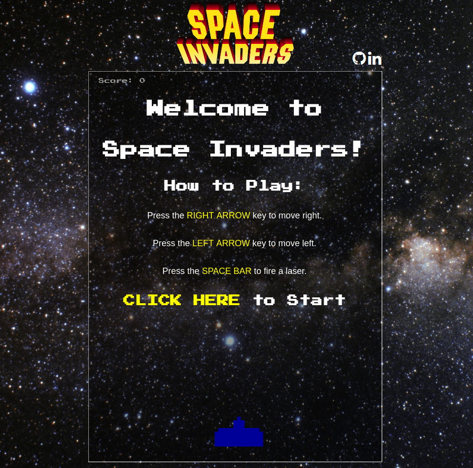
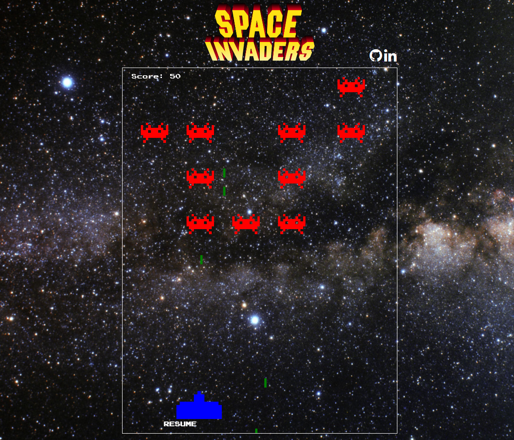

Space Invaders is a classic arcade game released in 1978. It is a fixed 2D shooter game where the player controls a laser cannon which they can move to the right or left while firing lasers. The payer's target is a fleet of alien ships which pan left and right while slowly moving closer to the ground. The goal of the game is to keep the alien ships from landing on the ground.

This version was completely hand rolled using HTML5, CSS3, JavaScript, and EaselJS.



### Functionality

All of the classic functionality is available.
Users can:
- [ ] Start, Pause, and Reset the game
- [ ] Move their laser cannon to the left and right
- [ ] Shoot at and hit moving alien pieces
- [ ] Acquire points for alien ships they hit
- [ ] Have aliens randomly shoot back at them

### Project and Design

The initial [proposal](docs/PROPOSAL.md) outlined the goals, vision, and possible layout of the project.

Design of the project reflects a simple and fun rendition of the classic game.



### Technology

The primary tool of this project was JavaScript. While I did utilize EaselJS to upload images and handle collision; movement, game management, and user controls are all handled in plain old JavaScript.

One issue I encountered dealt with moving pieces on the board. I had originally looked into the `Tick` feature of EaselJS, but it didn't allow the flexibility I was needing and it slowed game-play when too many objects resided on the play field.

```javascript
function handleAlienLaserTick(laser) {
  timeouts.push (
  setTimeout(function () {
    // movement
    laser.y += 10;
    stage.update();
      // Check Collision
      if (laser.y < board.height + 20) {
        var pt = laser.localToLocal(0,0, cannon);
        if (cannon.hitTest(pt.x,pt.y)) {
          // Trigger Loss if Collision
          status = "LOST";
          pauseGame();
          removeHidden("loss");
          addHidden("pause");
        }
        // Continue moving if there was no hit
        if (status === "PLAY") {
          handleAlienLaserTick(laser);
        }
      }
   }, 50))
 }
```

By setting a simple `timeout` which, if appropriate, called itself, I was able to allow objects to move independently or in sync as well as handle various logic at each move.

This, however, created its own challenge. I wanted users to be able to start and stop game-play. With the `timeout` solution, each object managed its own movement with its own `timeout`. To overcome this obstacle I researched that that `timeouts` were capable of being `pushed` into `arrays`. Creating a global variable which managed all `timeouts` allowed me to call `clearTimeout` on all present `timeouts`, to resume I simply reassigned objects with their appropriate movement logic.

```javascript
function pauseGame() {
  if (timeouts) {
    for (var i = 0; i < timeouts.length; i++) {
      clearTimeout(timeouts[i]);
    }
  }
  timeouts = [];
}

function restartGame() {
  if (aliens) {
    for (var i = 0; i < aliens.length; i++) {
      handleAlienTick(aliens[i]);
    }
  }
  if (lasers) {
    for (var i = 0; i < lasers.length; i++) {
      handleLaserTick(lasers[i]);
    }
  }
  if (alienLasers) {
    for (var i = 0; i < alienLasers.length; i++) {
      handleAlienLaserTick(alienLasers[i]);
    }
  }
}
```

### Future Implementations

Most prominently I would like to DRY up my code and reorganize into an Object Oriented design. This project had a rapid requirement date, so my original focus was to generate a viable product.

Additional Features I'd like to add include:
- [ ] Add multiple levels with increasing difficulty
- [ ] Add Music and Audio for Laser fire
- [ ] Animate alien movement
- [ ] Rescale for Responsive Design
