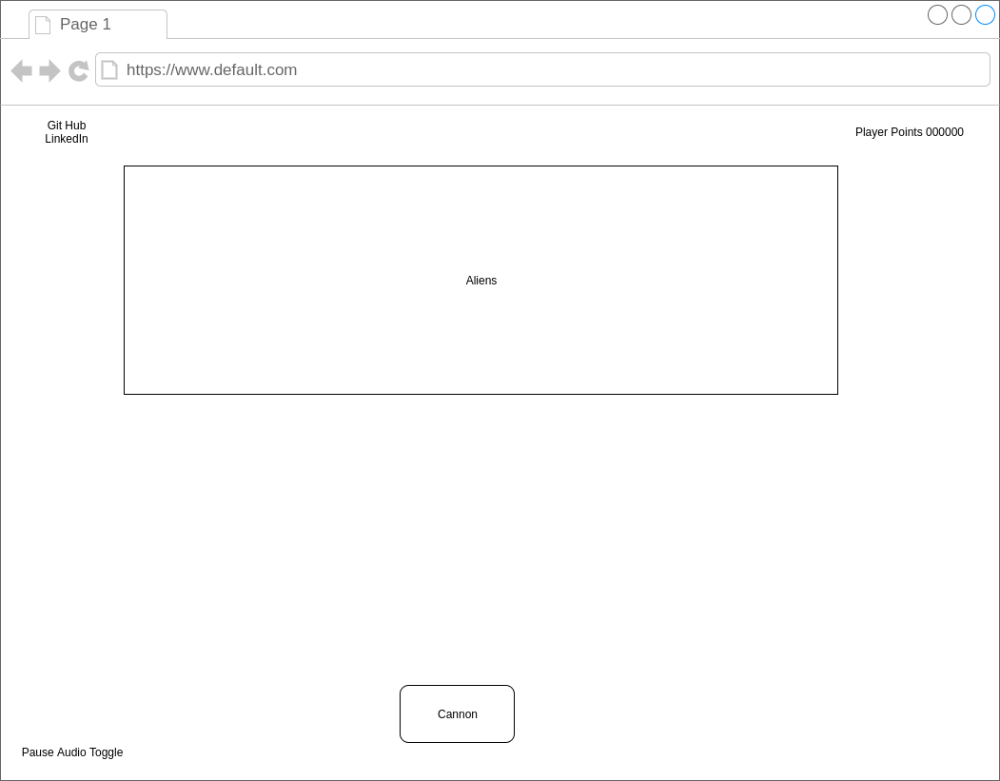

## Space Invaders

### Background

Space Invaders is a classic arcade game released in 1978. It is a fixed 2D shooter game where the player controls a laser cannon which they can move to the right or left while firing lasers. The payer's target is a fleet of alien ships which pan left and right while slowly moving closer to the ground. The goal of the game is to keep the alien ships from landing on the ground.

### Functionality & MVP  

In this implementation of Space Invaders users will be able to:

- [ ] Start, pause, and reset the game
- [ ] Move their laser cannon to the left and right
- [ ] Shoot at and hit moving alien pieces
- [ ] Acquire points for alien ships they hit

### Wireframes

The play area of this app will fill the entire browser window. In the upper left there will be links to the GitHub repository and a my LinkedIn account. In the upper right will be the players current score. The lower left will hold buttons to pause/resume the game or toggle audio.

### Architecture and Technologies

This project will be implemented with the following technologies:

- Vanilla JavaScript and `jquery` for overall structure and game logic,
- `Easel.js` with `HTML5 Canvas` for DOM manipulation and rendering,
- Webpack to bundle and serve up the various scripts.

In addition to the webpack entry file, there will be three scripts involved in this project:

`game.js`: this script will handle the logic for creating and updating the game.

`board.js`: this script will hold information required to setup the display field to fit maximum dimensions.

`laser.js`: this script will handle the logic more laser movement and assess if a laser has made an appropriate connection with an alien or cannon piece.

`cannon.js`: this script will manage the movement and status of the cannon piece.

`alien.js`: this script will be responsible for generating aliens, managing their movement and determining their status.

### Implementation Timeline

**Day 1**: Research and review JavaScript project setup, primarily dealing with Canvas and piece movement logic. Initial files for the project will be setup with comment outlines of what each file will need.

- Review technologies required for the project.
- Create a commented skeleton.

**Day 2**: Get all pieces (aliens, cannon, lasers) on the board and moving in their respective fashions.

- Render cannon with movements and user controls
- Render aliens with movements
- Render lasers with movement based on user triggered events

**Day 3**: Finalize the logic and point structure of the game. Ensure all pieces are interacting properly and triggering the desired outcome.

- Lasers that come in contact with aliens should remove the alien from the board
- Destroyed aliens should increase the users points
- Aliens that travel to the base of the board should trigger a Failed Game
- Destroying all aliens should trigger a Won Game

**Day 4**: Add start/stop/reset controls, personal links, and appropriate style

- Create user controls
- Style

### Bonus features

- [ ] Add multiple levels levels
- [ ] Allow aliens to fire back at the cannon
- [ ] Include Audio with toggle controls
- [ ] Include barriers which shelter the cannon and aliens from lasers, but can be destroyed by lasers
